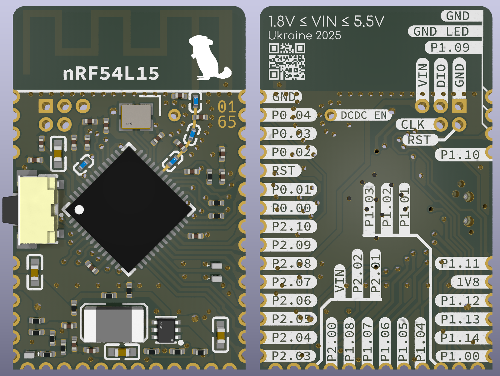
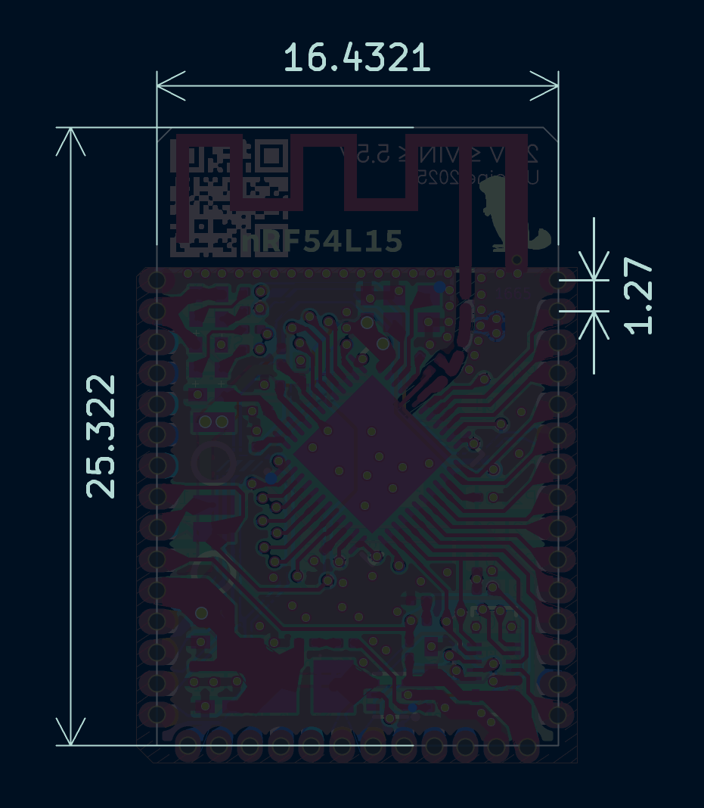
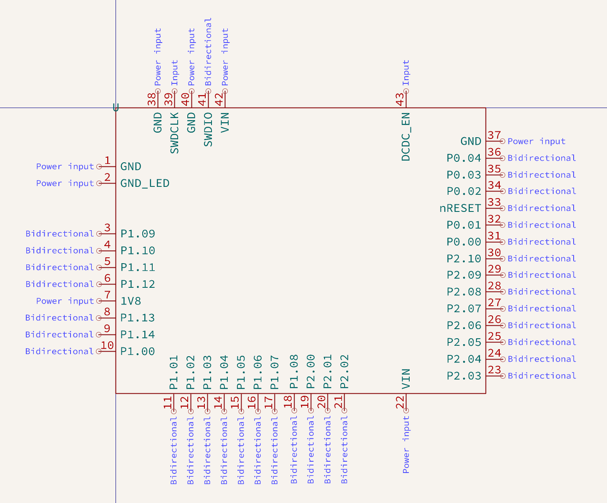
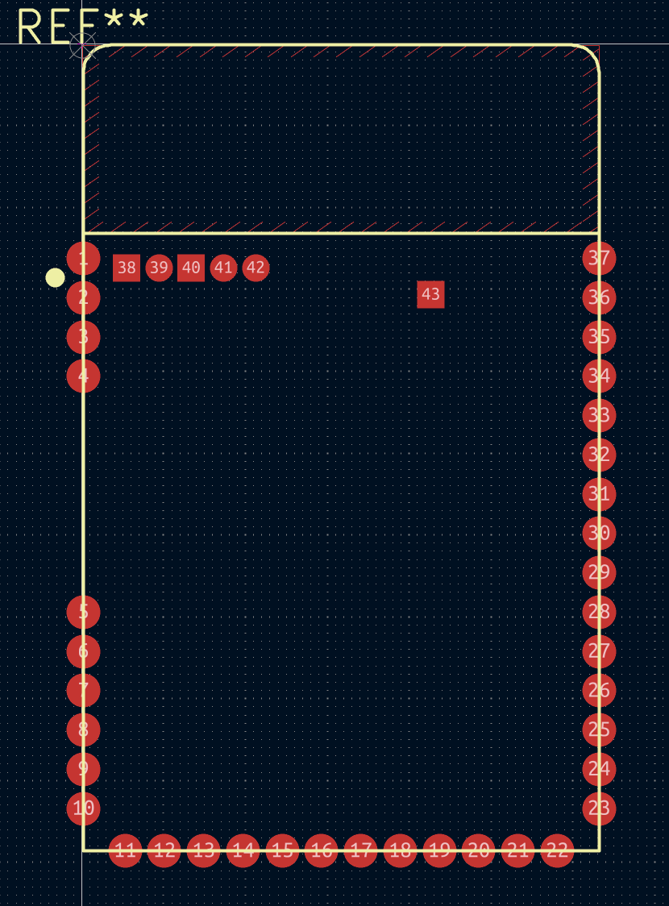

## Codename "Chinchilla"

## Features

1. Full IO set: all the pins (except power and antenna) are present
2. Compact design: the board is 16x25 mm with 1.2 mm height (total height ≈ 4.8 mm)
3. Ultra efficient: featuring TLV62569 with ≥94% efficiency at (almost) any load
4. 1V8 pin can be used as both input (if VIN not connected) and output (up to 1.5A)
5. Power LED (40 µA) and 2 programmable LEDs (200 µA) that can be isolated to free the pins
6. On-board "reset" switch and an additional general purpose button on P1.12 (High/High-Z)
7. 1.27 mm pitch header footprint with programming pins
8. Impedance of (almost) all traces is close to 50Ω
9. Ready to use KiCAD symbol and footprint

## Dimensions

## Symbol

## Footprint

