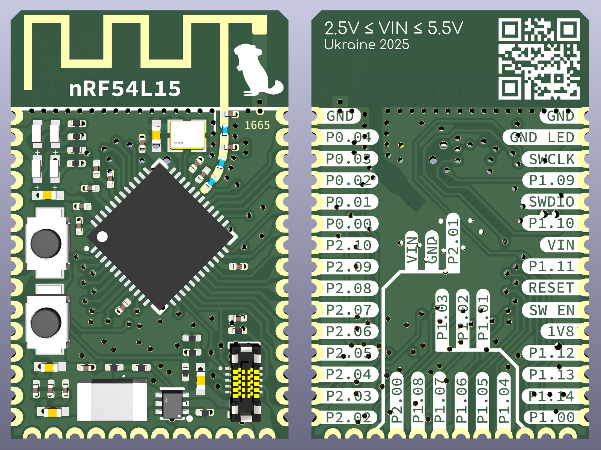

## Codename "Chinchilla"

### ❗️ WORK IN PROGRESS ❗️

## Features

1. Full IO set: all the pins are present
2. Compact design: the board is 16.4x25.3 mm width and ≈4.8 mm of total height
3. Ultra efficient: featuring TLV62569 with ≥94% efficiency at (almost) any load
4. 1V8 pin can be used as both input (if VIN not connected) and output (up to 1.5A)
5. 4 programmable LEDs (200 µA) that can be isolated to free the pins
6. On-board "reset" switch and an additional general purpose button (High/High-Z)
7. 1.27 mm pitch header footprint with programming pins
8. Impedance of (almost) all traces is close to 50Ω
9. Board-to-board connector with programming, power and GPIO pins 

## Stackup

JLC06121H-3313

## Dimensions

